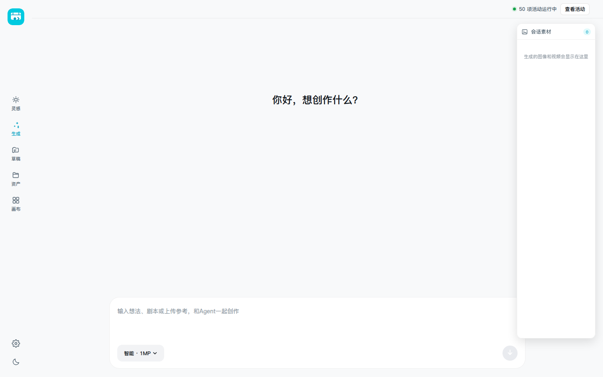
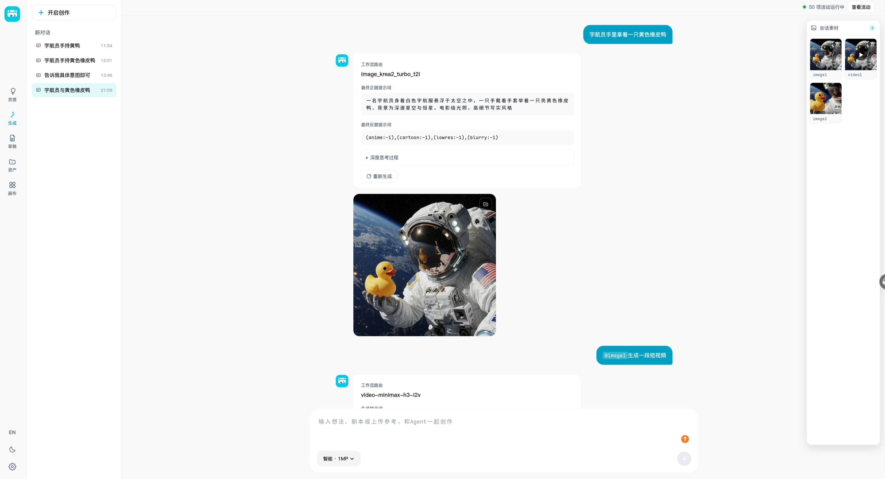
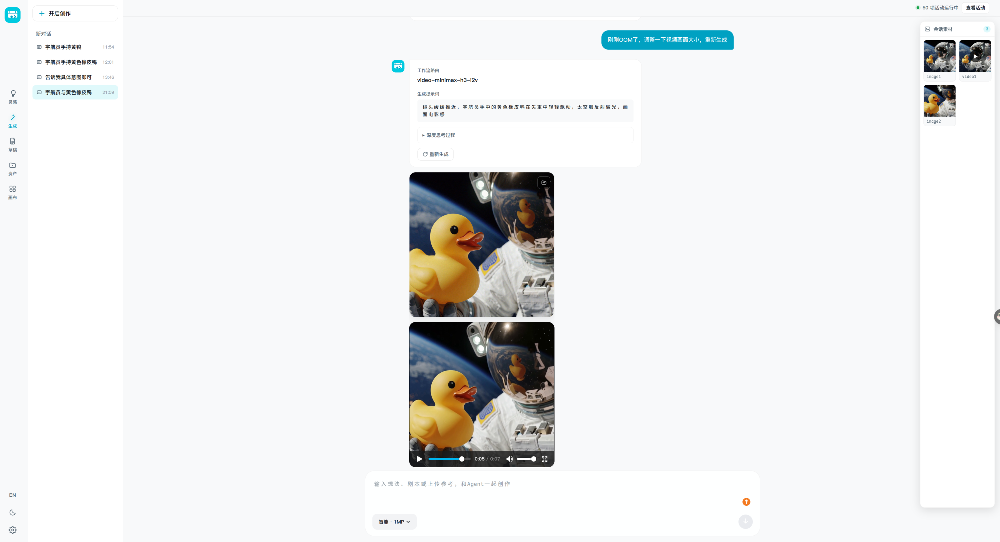
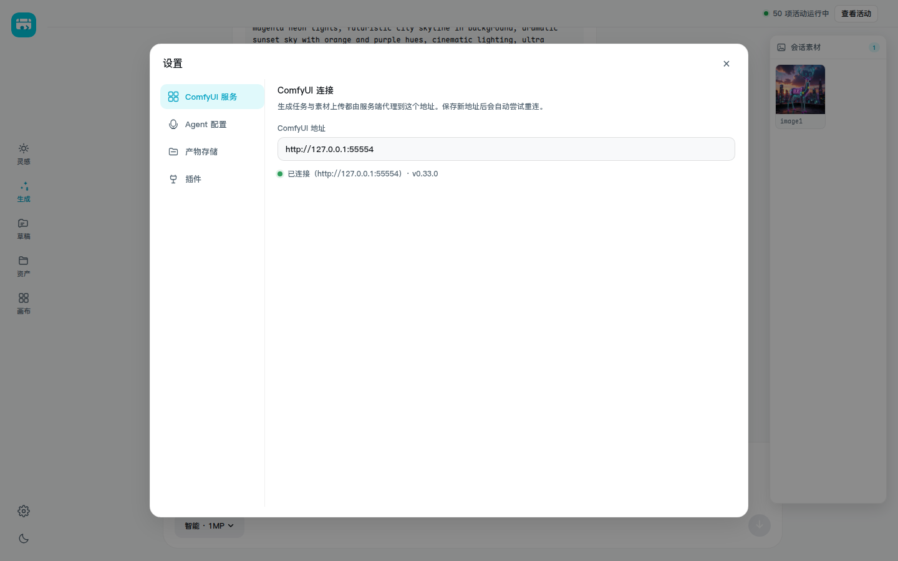
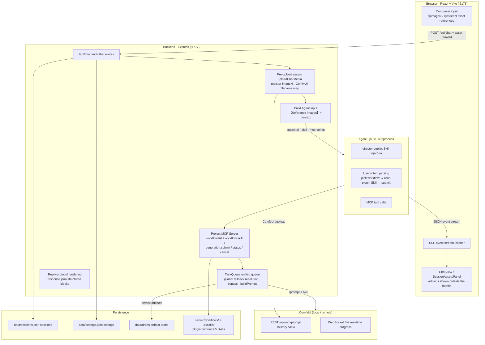
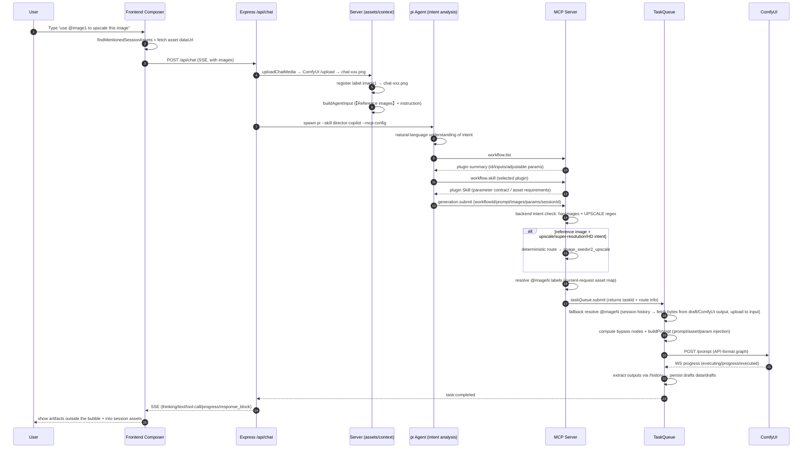

<p align="right"><a href="README.md">简体中文</a> · English</p>

<div align="center">

# 🎬 Director Workbench · 导演工作台

**Let AI direct your creations — drive ComfyUI workflows with natural language**

A local-first, all-in-one AI creation platform: a built-in Agent understands your creative intent, automatically selects, orchestrates, and submits ComfyUI workflows (text-to-image / image-to-image / image upscaling / text-to-video / image-to-video), streams real-time generation progress, and archives every artifact into session assets and drafts.

</div>

## ✨ Key Features

- **🧑‍🎨 Director Copilot Agent**: powered by the `pi` Agent + project Skills — parses natural-language intent → queries the workflow catalog → reads the plugin's usage docs → submits the generation task, with structured event-stream feedback throughout (no log spam, no polling).
- **🔌 Workflow plugin system**: drop in any `workflow_api.json` and it just works — inputs / outputs / adjustable parameters are auto-introspected; supports import, enable/disable, node mapping, and parameter selection.
- **📖 Per-plugin adapted Skills**: every plugin gets its own tailored `SKILL.md` that codifies that plugin's parameter contract, asset requirements, and usage rules into the Agent's operating protocol — the Agent must read the corresponding plugin's Skill and prepare parameters per its rules before submitting a task; hand-editable, LLM-regenerable, one-click revert — paired with a configurable `response.json` reply protocol that controls structured display of reply blocks (collapsible / code blocks / timing).
- **🔗 Deep ComfyUI integration**: talks to the native REST + WebSocket APIs directly (zero third-party SDKs), auto-adapts to any third-party node, real-time progress, task cancellation, and no CORS issues for remote instances.
- **🖼️ Session assets (`@imageN` / `@videoN`)**: generated artifacts are automatically collected into the asset panel; type `@` in the composer to reference them as inputs for image-to-image, image-to-video, or upscaling.
- **🗂️ Draft archive**: every artifact is cached locally (`data/drafts`) with preview, delete, and reveal-in-file-manager support.
- **⚙️ Full settings panel**: ComfyUI address, Agent model / thinking level, default image-generation parameters, artifact storage directory, plugin toggles — persisted to `settings.json` (atomic writes).

## 📸 Screenshots

| Home · Workbench | Chat with the Agent |
|---|---|
|  |  |
| Real generation · structured reply | Settings panel |
|  |  |

## 🧱 Tech Stack

| Layer | Technology |
|---|---|
| Frontend | React 18 · Vite 6 · TypeScript 5.7 |
| Backend | Node.js · Express 4 · TypeScript (run via `tsx`) |
| Agent | [pi-coding-agent](https://github.com/earendil-works/pi-coding-agent) (CLI subprocess + Skill injection) |
| Model execution | ComfyUI (local / remote, native HTTP + WebSocket) |
| Testing | Vitest (server) · tsc + vite build (web) |

## 🚀 Quick Start

### Prerequisites

- **Node.js ≥ 22** (the ComfyUI client uses Node's built-in WebSocket — zero extra dependencies)
- **pnpm ≥ 9**
- **ComfyUI** running (default `http://127.0.0.1:8188` locally; a remote server also works)
- **pi CLI** installed and configured with a model (the server reads available models via `pi --list-models`; pick one in the settings panel)

### Install & Run

```bash
# 1. Install dependencies
pnpm install

# 2. Start (launches both server and web)
pnpm dev
```

- Frontend: <http://127.0.0.1:5173> (Vite, proxies `/api` automatically)
- Backend: <http://127.0.0.1:4777>

Production build:

```bash
pnpm build   # web build (tsc --noEmit + vite build)
pnpm start   # server only
```

### Configure the ComfyUI address

```bash
# Via environment variable (defaults to http://127.0.0.1:8188)
COMFYUI_BASE_URL=http://192.168.1.10:8188 pnpm dev
```

You can also change it in the **settings panel** — it's written to `server/data/settings.json` (`comfyui.baseUrl`), restored automatically on next start, and environment variables still take precedence.

> This project only uses local / self-hosted ComfyUI — no Comfy Cloud account or cloud credentials required.

## 🧩 Workflow Plugin System

### Bundled plugins

`server/workflows/` ships with the following plugins (all `workflow_api.json`):

| Plugin | Capability |
|---|---|
| `image_krea2_turbo_t2i` | Krea2 Turbo text-to-image |
| `image_seedvr2_upscale` | SeedVR2 image upscaling / super-resolution |
| `video-minimax-h3-t2v` | MiniMax H3 text-to-video |
| `video-minimax-h3-i2v` | MiniMax H3 image-to-video |
| `video-minimax-h3-r2v` | MiniMax H3 reference-image-to-video |

### Import any workflow

Import any `workflow_api.json` (or an official LiteGraph UI template) through the UI, and the system will:

1. **Auto-detect** inputs (prompt / image / video), outputs (image / video / text), and adjustable parameters (KSampler's seed / steps / cfg / denoise, `SEED`-typed fields, etc.) via `/object_info`;
2. Generate the **manifest contract** (params / inputs / outputs) for manual mapping and selection in the "Node view";
3. Auto-generate the **plugin Skill** (`.pi/skills/<plugin-id>/SKILL.md`) and **reply protocol** (`response.json`) so the Agent can call and present results correctly.

### Plugin Skills & reply protocol

- **Skill**: a per-plugin operating protocol (controllable parameters, inputs/outputs, usage rules); the Agent must read it and prepare parameters per its rules before submitting a task.
- **Reply protocol** (`response.json`, version 1): each reply block configures its own `container` (`text | collapsible`), `format` (`plain | markdown | code`), and timing (`submit | complete | always`), with support for collapsible code blocks; placeholders are limited to visible inputs, `llm !== false` parameters, and sanitized generation fields.

## 🤖 Agent & MCP

During a conversation the backend spawns `pi` as a subprocess, injects the `director-copilot` Skill (`.pi/skills/director-copilot/SKILL.md`), and mounts the project MCP Server (`director-workbench-mcp`) via a temporary `--mcp-config` — strictly limited to MCP tools (host dev tools disabled).

| MCP tool | Purpose |
|---|---|
| `workflow.list` | Lists a compact summary of available workflow plugins |
| `workflow.skill` | Fetches the detailed usage docs for a selected plugin (must-read before submitting) |
| `generation.submit` | Submits image / upscaling / video tasks |
| `generation.status` | Queries task status (can be disabled in settings; progress streams via events) |
| `generation.cancel` | Cancels a task |

**Deterministic routing**: when the user provides a reference image and expresses an upscaling / super-resolution / HD intent, the backend deterministically routes to the SeedVR2 image-upscaling workflow — no need for the Agent to choose.

## 🏗️ Architecture



### Full sequence: from user request to final generation



**ComfyUI integration notes** (see [`docs/comfyui-integration.md`](docs/comfyui-integration.md)):

- Native REST + WebSocket, no third-party SDKs (the official SDK targets Comfy Cloud and is overkill for a local single machine);
- Supports both API format and LiteGraph UI format (auto-conversion + subgraph expansion);
- Inputs / outputs / parameters are all dynamically recognized from `/object_info` — no maintenance list needed for any third-party node;
- Images are served through the `/comfyui/view` server-side proxy, so local and remote setups are both CORS-free;
- Artifacts are archived both as drafts (configurable storage directory) and chat results.

### Intent analysis & the MCP call chain (key area)

Intent parsing happens in **two layers** that back each other up:

1. **Agent (LLM) layer — natural-language understanding**: the `pi` subprocess is injected with the `director-copilot` Skill, and the model understands the user's intent (text-to-image / image-to-image / upscaling / text-to-video / image-to-video) before deciding which workflow to call. The Skill constrains its judgment: upscale / super-resolution / HD wording counts as upscaling intent and must carry a reference image; pure ideation must not auto-submit; `@imageN` only uses the assets the user actually mentions.
2. **Backend (MCP) layer — deterministic validation**: `generation.submit` re-judges intent server-side so the Agent cannot pick the wrong workflow:

| Input | Intent | Routing result |
|---|---|---|
| No reference image | `text_to_image` / `text_to_video` | keep the Agent-requested workflow |
| Reference image · no upscale wording | `image_to_image` | keep the Agent-requested workflow |
| Reference image · upscale/super-res/HD wording | `image_upscale` | **deterministic route** → SeedVR2 upscaling workflow |
| Reference video (± reference image) | `text_to_video` / `image_to_video` | keep the Agent-requested workflow |

> Deterministic routing exists so the Agent cannot misuse a text-to-image workflow (which has no image input — reference images would be silently dropped). The route is returned as a `WorkflowRoute` (`requestedWorkflowId / finalWorkflowId / intent / forced / reason`) with the task and SSE events, and the UI shows the actual route.

**MCP call chain (mandatory before submitting)**: `workflow.list` (pick a workflow) → `workflow.skill` (read that plugin's usage docs; its parameter contract is authoritative) → `generation.submit` (submit the task; `images` may pass `@imageN` labels, which the backend auto-resolves to real files).

**Asset-reference resolution (`@imageN` → real file)**:

- The frontend turns `@`-mentioned assets into dataUrls sent with the request (regenerate / edit-resend attach them too);
- The MCP layer resolves them directly from the current request's asset map;
- The queue layer falls back: rebuilds the label map from session history (same semantics as the frontend's `extractSessionAssets`), fetches bytes from drafts or ComfyUI output, uploads them to the input directory — independent of whether the frontend attached them.

## 📁 Directory Structure

```
.
├── server/                    # Express + TypeScript backend (4777)
│   ├── src/
│   │   ├── index.ts           # HTTP entry / API routes
│   │   ├── comfyui.ts         # Native ComfyUI client (REST + WS, zero deps)
│   │   ├── workflow.ts        # Workflow introspection / format conversion / prompt building
│   │   ├── workflow-plugin-*  # Plugin import, manifest contracts, Skills, reply protocols
│   │   ├── mcp/               # Project MCP Server (director-workbench-mcp)
│   │   ├── agent/             # pi Agent bridge (spawn / event stream / skill injection)
│   │   ├── tasks/             # Unified task queue (submit / cancel / event buffering)
│   │   ├── sessions.ts        # Sessions (JSON persistence + SSE)
│   │   ├── drafts.ts          # Drafts (local artifact cache)
│   │   └── settings.ts        # Settings persistence (atomic writes)
│   └── workflows/             # Bundled workflow plugins
├── web/                       # React 18 + Vite frontend (5173)
│   └── src/
│       ├── components/        # ChatView / Composer / SessionAssetsPanel / …
│       ├── App.tsx            # App shell & state management
│       └── api.ts             # API client
├── .pi/skills/                # Agent Skills (director-copilot + per-plugin Skills)
└── docs/                      # Design docs
```

Runtime data (gitignored) lives in `server/data/`: `settings.json`, `sessions.json`, `drafts.json`, `tasks.json`.

## 🧪 Development & Testing

```bash
# Backend unit tests (vitest)
cd server && pnpm test

# Frontend typecheck + build
cd web && pnpm build
```

## 📚 Related Docs

- [`docs/comfyui-integration.md`](docs/comfyui-integration.md) — ComfyUI integration design (auto-adaptation mechanism, architecture, verification notes)

## 🗺️ Roadmap

**Implemented**

- ✅ Text-to-image (Krea2 Turbo)
- ✅ Image-to-video (MiniMax H3)

**In progress**

- 🚧 Single-image reference generation (Krea2-Edit)
- 🚧 Multi-image reference generation (Krea2-Edit)
- 🚧 Reference-image-to-video (MiniMax H3)
