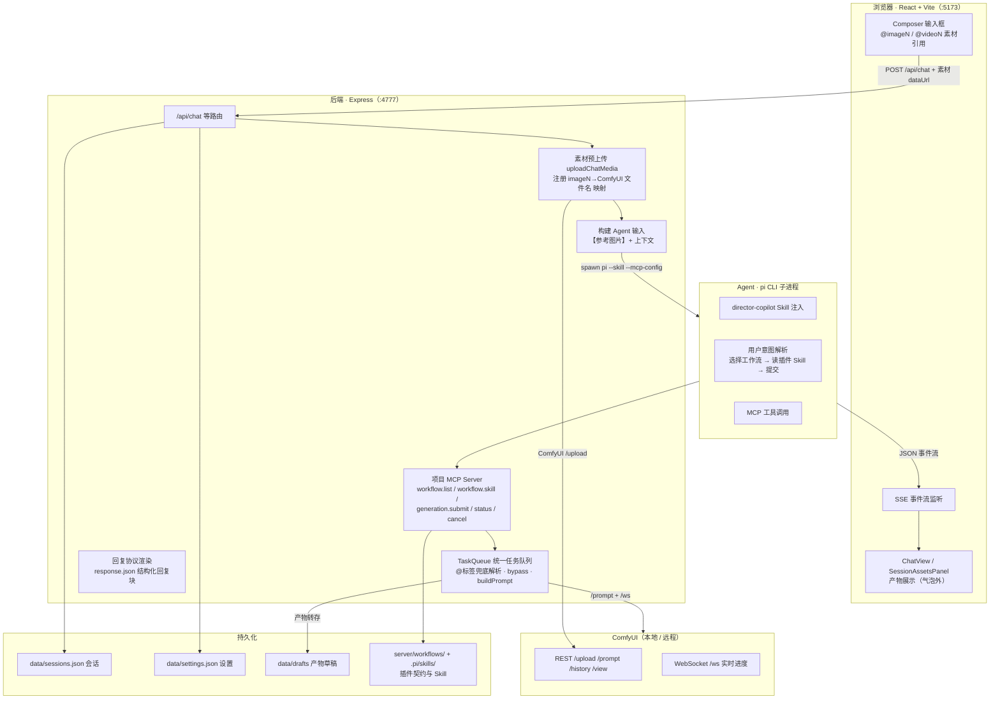
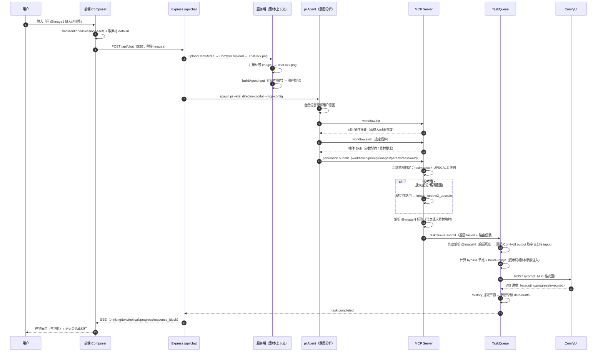

<p align="right"><a href="README.en.md">English</a> · 简体中文</p>

<div align="center">

# 🎨 Minidream

**对话式生成 Agent —— 站在 Minimax 巨人肩膀上开源**

**Minidream** 的名字，是 *Mini* 与 *Dream* 的合体：*Mini* 取自 **MiniMax**——我们站在这个巨人开源的肩膀上（MiniMax H3 等模型生态就是它的生成底座）；*Dream* 则致敬 **Seedream** 式「对话即生成」的愿景——像聊天一样，把想法自然地说成一张图、一段视频。

这是一个本地优先、开源免费的一站式 AI 创作平台，把生成能力封装成一个**真正会对话的创作 Agent**：Agent 理解 ComfyUI 节点图，把工作流变成对话式生成的一部分——你不需要学习 ComfyUI，只要像跟朋友聊天一样说出想法，或 `@` 一张参考图，Agent 就会理解你的意图，自动选择、编排并提交合适的生成工作流（文生图 / 图生图 / 图像放大 / 文生视频 / 图生视频），实时反馈生成进度，并把每一次产物沉淀为会话素材与草稿——让灵感在对话中有来有回、自然延续。

[](https://ko-fi.com/Q3L225HIJW)

</div>

## ✨ 核心特性

- **🧑‍🎨 创作 Agent（Director Copilot）**：基于 `pi` Agent + 项目 Skill 驱动，解析自然语言意图 → 查询工作流清单 → 读取插件使用说明 → 提交生成任务，全程结构化事件流反馈，不刷屏、不轮询。
- **🔌 工作流插件体系**：任意 `workflow_api.json` 拖入即用，自动 introspection 出输入 / 输出 / 可调参数；支持插件导入、启用停用、节点映射、参数勾选。
- **📖 插件 Skill 自动适配**：每个插件独立生成定制 `SKILL.md`，把该插件的参数契约、素材要求、使用规则固化为 Agent 的操作协议——Agent 提交任务前必须读取对应插件 Skill 并按其规则准备参数；可手工编辑、LLM 重新生成、一键回退；配合可配置的 `response.json` 回复协议，控制回复块的结构化展示（折叠 / 代码块 / 时机）。
- **🔗 深度 ComfyUI 对接**：直连原生 REST + WebSocket（零第三方 SDK），自动适配任意第三方节点，实时进度、任务取消、远程无 CORS。
- **🖼️ 会话素材（`@imageN` / `@videoN`）**：生成产物自动进入素材栏，输入框 `@` 提及即可作为图生图 / 图生视频 / 图像放大的参考素材。
- **🗂️ 草稿归档**：所有产物本地缓存（`data/drafts`），支持预览、删除、在系统文件管理器中定位。
- **⚙️ 完整设置面板**：ComfyUI 地址、Agent 模型 / 思考强度、图像生成默认参数、产物存储目录、插件开关，持久化到 `settings.json`（原子写）。

## 📸 界面预览

| 主页 · 生成工作台 | 与 Agent 对话 |
|---|---|
|  |  |
| 真实生成 · 结构化回复 | 设置面板 |
|  |  |

## 🧱 技术栈

| 层 | 技术 |
|---|---|
| 前端 | React 18 · Vite 6 · TypeScript 5.7 |
| 后端 | Node.js · Express 4 · TypeScript（`tsx` 运行） |
| Agent | [pi-coding-agent](https://github.com/earendil-works/pi-coding-agent)（CLI 子进程 + Skill 注入） |
| 模型执行 | ComfyUI（本地 / 远程，原生 HTTP + WebSocket 直连） |
| 测试 | Vitest（server）· tsc + vite build（web） |

## 🚀 快速开始

### 环境要求

- **Node.js ≥ 22**（ComfyUI 客户端使用 Node 内置 WebSocket，零额外依赖）
- **pnpm ≥ 9**
- **ComfyUI** 已启动（本地默认 `http://127.0.0.1:8188`，远程服务器亦可）
- **pi CLI** 已安装并配置模型（服务端通过 `pi --list-models` 读取可用模型，在设置面板选择）

### 安装与运行

```bash
# 1. 安装依赖
pnpm install

# 2. 启动（同时拉起 server 与 web）
pnpm dev
```

- 前端：<http://127.0.0.1:5173>（Vite，自动代理 `/api`）
- 后端：<http://127.0.0.1:4777>

生产构建：

```bash
pnpm build   # web 构建（tsc --noEmit + vite build）
pnpm start   # 仅启动 server
```

### 配置 ComfyUI 地址

```bash
# 环境变量方式（默认 http://127.0.0.1:8188）
COMFYUI_BASE_URL=http://192.168.1.10:8188 pnpm dev
```

也可以在 **设置面板** 中修改，写入 `server/data/settings.json`（`comfyui.baseUrl`），下次启动自动恢复，环境变量仍可覆盖。

> 本项目仅使用本地 / 自托管 ComfyUI，不依赖 Comfy Cloud 账号或云端凭证。

## 🧩 工作流插件体系

### 内置插件

`server/workflows/` 内置以下插件（均为 `workflow_api.json`）：

| 插件 | 能力 |
|---|---|
| `image_krea2_turbo_t2i` | Krea2 Turbo 文生图 |
| `image_seedvr2_upscale` | SeedVR2 图像放大 / 超分 |
| `video-minimax-h3-t2v` | MiniMax H3 文生视频 |
| `video-minimax-h3-i2v` | MiniMax H3 图生视频 |
| `video-minimax-h3-r2v` | MiniMax H3 参考图生视频 |

### 导入任意工作流

把任意 `workflow_api.json`（或官方 LiteGraph UI 模板）通过界面导入，系统会：

1. 用 `/object_info` **自动探测**输入（提示词 / 图片 / 视频）、输出（图片 / 视频 / 文本）与可调参数（KSampler 的 seed / steps / cfg / denoise，`SEED` 类型字段等）；
2. 生成 **manifest 契约**（params / inputs / outputs），在「节点视图」中手动映射与勾选；
3. 自动生成 **插件 Skill**（`.pi/skills/<plugin-id>/SKILL.md`）与 **回复协议**（`response.json`），供 Agent 正确调用与展示。

### 插件 Skill 与回复协议

- **Skill**：针对该插件定制的操作协议（可控制参数、输入输出、使用规则），Agent 提交任务前必须读取并按其规则准备参数。
- **回复协议**（`response.json`，version 1）：每个回复块独立配置 `container`（`text | collapsible`）、`format`（`plain | markdown | code`）与时机（`submit | complete | always`），支持可折叠代码块；占位符仅限可见输入、`llm !== false` 参数及脱敏生成字段。

## 🤖 Agent 与 MCP

对话时后端以子进程启动 `pi`，注入 `director-copilot` Skill（`.pi/skills/director-copilot/SKILL.md`），并通过临时 `--mcp-config` 挂载项目 MCP Server（`minidream-mcp`），严格限制为 MCP 工具（禁用宿主开发工具）。

| MCP 工具 | 作用 |
|---|---|
| `workflow.list` | 列出可用工作流插件的紧凑摘要 |
| `workflow.skill` | 获取选定插件的详细使用说明（提交前必读） |
| `generation.submit` | 提交图像 / 放大 / 视频任务 |
| `generation.status` | 查询任务状态（可在设置中关闭，进度走事件流） |
| `generation.cancel` | 取消任务 |

**确定性路由**：当用户提供参考图并表达放大 / 超分 / 高清化意图时，后端会确定性路由到 SeedVR2 图像放大工作流，无需 Agent 自行选择。

## 🏗️ 架构



### 完整时序：从用户请求到最终生成



**ComfyUI 对接要点**（详见 [`docs/comfyui-integration.md`](docs/comfyui-integration.md)）：

- 原生 REST + WebSocket 直连，不引入任何第三方 SDK（官方 SDK 面向 Comfy Cloud，对本地单机过重）；
- 支持 API 格式与 LiteGraph UI 格式（自动转换 + 子图展开）；
- 输入 / 输出 / 参数全部基于 `/object_info` 动态识别，任意第三方节点无需维护清单；
- 图片经 `/comfyui/view` 服务端代理，本地 / 远程均无 CORS 问题；
- 产物同时归档为草稿（可配置存储目录）与聊天结果。

### 意图分析与 MCP 调用链（重点）

意图解析分为**两层**，互相兜底：

1. **Agent（LLM）层 — 自然语言理解**：`pi` 子进程注入 `director-copilot` Skill，由模型理解用户意图（文生图 / 图生图 / 图像放大 / 文生视频 / 图生视频），再决定调用哪个工作流。Skill 约束其判断口径：放大 / 超分 / 高清化视为放大意图且必须带参考图；仅构思不擅自提交；`@imageN` 只使用用户实际提及的素材。
2. **后端（MCP）层 — 确定性校验**：`generation.submit` 在服务端再次判定意图，防止 Agent 选错工作流：

| 输入 | 意图判定 | 路由结果 |
|---|---|---|
| 无参考图 | `text_to_image` / `text_to_video` | 沿用 Agent 请求的工作流 |
| 有参考图 · 无放大词 | `image_to_image` | 沿用 Agent 请求的工作流 |
| 有参考图 · 含放大/超分/高清词 | `image_upscale` | **确定性路由** → SeedVR2 放大工作流 |
| 有参考视频（±参考图） | `text_to_video` / `image_to_video` | 沿用 Agent 请求的工作流 |

> 确定性路由是为了避免 Agent 误用文生图工作流（其无图像输入，参考图会被静默丢弃）。路由结果以 `WorkflowRoute`（`requestedWorkflowId / finalWorkflowId / intent / forced / reason`）随任务与 SSE 事件返回，界面上展示实际路由。

**MCP 调用链（提交前必经）**：`workflow.list`（选工作流）→ `workflow.skill`（读该插件使用说明，参数契约以它为准）→ `generation.submit`（提交任务，`images` 可传 `@imageN` 标签，后端自动解析为真实文件）。

**素材引用解析（`@imageN` → 真实文件）**：

- 前端把 `@` 提及的素材转为 dataUrl 随请求上传（重新生成 / 编辑重发也附带）；
- MCP 层按当次请求的素材映射直接解析；
- 队列层兜底：按会话历史重建标签映射（与前端 `extractSessionAssets` 同口径），从草稿或 ComfyUI output 取字节上传到 input 目录，不依赖前端是否附带。

## 📁 目录结构

```
.
├── server/                    # Express + TypeScript 后端（4777）
│   ├── src/
│   │   ├── index.ts           # HTTP 入口 / API 路由
│   │   ├── comfyui.ts         # ComfyUI 原生客户端（REST + WS，零依赖）
│   │   ├── workflow.ts        # 工作流 introspection / 格式转换 / prompt 构建
│   │   ├── workflow-plugin-*  # 插件导入、manifest 契约、Skill、回复协议
│   │   ├── mcp/               # 项目 MCP Server（minidream-mcp）
│   │   ├── agent/             # pi Agent 桥接（spawn / 事件流 / skill 注入）
│   │   ├── tasks/             # 统一任务队列（提交 / 取消 / 事件缓冲）
│   │   ├── sessions.ts        # 会话（JSON 持久化 + SSE）
│   │   ├── drafts.ts          # 草稿（产物本地缓存）
│   │   └── settings.ts        # 设置持久化（原子写）
│   └── workflows/             # 内置工作流插件
├── web/                       # React 18 + Vite 前端（5173）
│   └── src/
│       ├── components/        # ChatView / Composer / SessionAssetsPanel / …
│       ├── App.tsx            # 应用外壳与状态管理
│       └── api.ts             # API 客户端
├── .pi/skills/                # Agent Skills（director-copilot + 各插件 Skill）
└── docs/                      # 设计文档
```

运行数据（已 gitignore）保存在 `server/data/`：`settings.json`、`sessions.json`、`drafts.json`、`tasks.json`。

## 🧪 开发与测试

```bash
# 后端单测（vitest）
cd server && pnpm test

# 前端类型检查 + 构建
cd web && pnpm build
```

## 📚 相关文档

- [`docs/comfyui-integration.md`](docs/comfyui-integration.md) — ComfyUI 对接设计（自动适配机制、架构、验证记录）

## 🗺️ TODO 路线图

**已实现**

- ✅ 文生图（Krea2 Turbo）
- ✅ 图生视频（MiniMax H3）

**正在适配**

- 🚧 单图参考生图（Krea2-Edit）
- 🚧 多图参考生图（Krea2-Edit）
- 🚧 参考图像生视频（MiniMax H3）

## 🙏 致谢

- [ComfyUI](https://github.com/Comfy-Org/ComfyUI) — 强大、可扩展的节点式生成工作流引擎，本项目的生成底座
- [custom-first-control-prompt](https://github.com/WM-CODER/custom-first-control-prompt) — 提示词前置注入 / 虚构对话历史的实现参考
